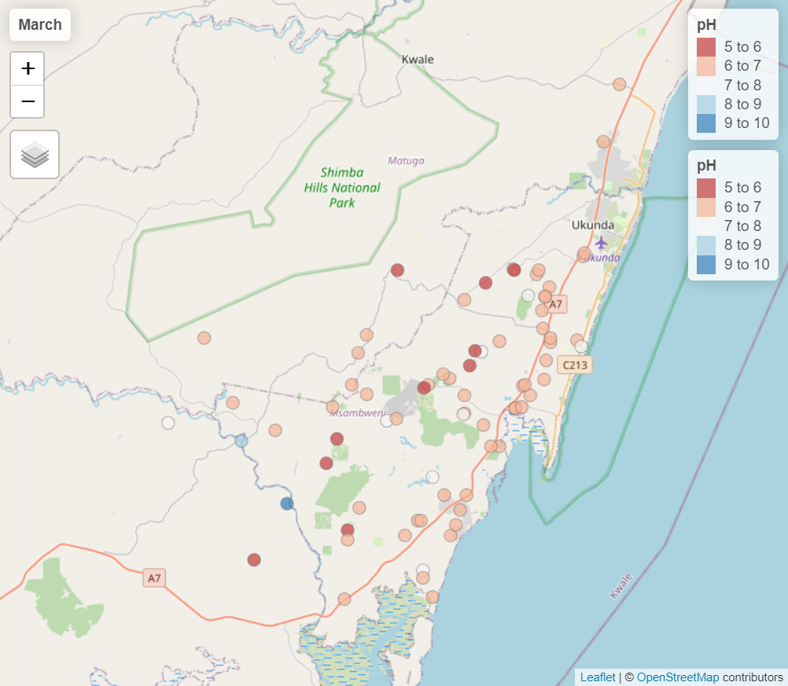

<!-- README.md is generated from README.Rmd. Please edit that file -->

```{r, include = FALSE}
knitr::opts_chunk$set(
  collapse = TRUE,
  comment = "#>",
  fig.path = "man/figures/README-",
  out.width = "100%",
  message = FALSE,
  warning = FALSE,
  fig.retina = 2,
  fig.align = 'center'
)

library(lubridate)
library(sf)
library(tidyverse)
library(tmap)
library(tmaptools)
```

# grdwtrsmpkwale

<!-- badges: start -->

[](https://creativecommons.org/licenses/by/4.0/)
[](https://github.com/openwashdata/grdwtrsmpkwale/actions/workflows/R-CMD-check.yaml)

<!-- badges: end -->

The goal of `grdwtrsmpkwale` is to provide datasets for research and
planning of water and solid waste management in Kwale, Kenya. This
package includes water anlaysis data collected in 2016 combined with the
geospatial data from the collection points. The data is collected part of the project UPGro (Unlocking the Potential of Groundwater for the Poor) which aimed to improve the evidence and understanding of groundwater across Sub-Saharan Africa to help tackle poverty.

## Installation

You can install the development version of 'grdwtrsmpkwale' from
[GitHub](https://github.com/openwashdata/grdwtrsmpkwale) with:

``` r
# install.packages("devtools")
devtools::install_github("openwashdata/grdwtrsmpkwale")
```

Alternatively, you can download the individual datasets as CSV or XLSX
file from the table below.

```{r echo=FALSE, message=FALSE, warning=FALSE}

extdata_path <- "https://github.com/openwashdata/grdwtrsmpkwale/raw/main/inst/extdata/"

read_csv("data-raw/dictionary.csv") |> 
  distinct(file_name) |> 
  mutate(file_name = str_remove(file_name, ".rda")) |> 
  rename(dataset = file_name) |> 
  mutate(
    CSV = paste0("[Download CSV](", extdata_path, dataset, ".csv)"),
    XLSX = paste0("[Download XLSX](", extdata_path, dataset, ".xlsx)")
  ) |> 
  knitr::kable()

```

# Introduction

This dataset contains results of two sampling campaigns conducted in
Kwale County Kenya in March and June 2016 by GHS/UPC as part of the Gro
for GooD project.[^1]

[^1]: <https://metadata.bgs.ac.uk/geonetwork/srv/eng/catalog.search#/metadata/50cdcbae-bc14-628b-e054-002128a47908>

Water samples from over 79 groundwater and 6 surface water (SW)
locations were analysed for major ions, stable isotopes, selected trace
constituents, electrical conductivity, nitrates, ammonia, pH, DO
(Dissolved Oxygen), Eh (oxidation / reduction potential), Temperature,
TOC (Total Organic Carbon) and field alkalinity. Most locations were
sampled in both March (dry season) and June (wet season).

# Data

This data package has two datasets: `water_samples` and
`selected_samples`.

```{r}
library(grdwtrsmpkwale)
```

## water_samples

This dataset contains data from an analysis of groundwater in Kwale,
Kenya. The data was collected once in March and once in June of 2016 for
each sampling spot. In total `r nrow(water_samples)` samples were taken
in `r nrow(distinct(water_samples, localization))` different
localisations that have their geospatial data included in this data
package. The sample analysis includes different measurements including
conductivity, temperature, pH-values and concentrations of different
elements/molecules for the groundwater samples.

The `water_samples` data set has `r ncol(water_samples)` variables and
`r nrow(water_samples)` observations. For an overview of the variable
names, see the following table.

```{r, eval=FALSE}
water_samples
```

```{r echo=FALSE, message=FALSE, warning=FALSE}
readr::read_csv("data-raw/dictionary.csv") |>
  dplyr::filter(file_name == "water_samples.rda") |>
  dplyr::select(variable_name:error) |> 
  knitr::kable() |> 
  kableExtra::kable_styling() |> 
  kableExtra::scroll_box(height = "400px")
```

```{r echo=FALSE, message=FALSE, warning=FALSE}
#| label: fig-location-plot
#| fig-cap: Locations of sampling spots

sf_samples <- st_as_sf(water_samples, coords = c("utm_x", "utm_y"), crs = 21037) |>
  st_transform(crs = 4236)

tmap_mode("plot")

sf_samples |>
  tm_shape() +
  tm_dots(size = 0.1, col = "pH", palette = "RdBu") +
  tm_graticules()

```

## selected_samples

This dataset contains data from an analysis of groundwater in Kwale,
Kenya. The data was collected three weeks in a row at 8 different
locations. The sample analysis includes measurements of conductivity,
temperature, pH-values and concentrations of different
elements/molecules.

The `selected_samples` data set has `r ncol(selected_samples)` variables
and `r nrow(selected_samples)` observations. For an overview of the
variable names, see the following table.

```{r, eval=FALSE}
selected_samples
```

```{r echo=FALSE, message=FALSE, warning=FALSE}
readr::read_csv("data-raw/dictionary.csv") |> 
  dplyr::filter(file_name == "selected_samples.rda") |> 
  dplyr::select(variable_name:error) |>  
  knitr::kable(show_col_types = FALSE) |> 
  kableExtra::kable_styling() |> 
  kableExtra::scroll_box(height = "400px")
```

## Example

```{r example, eval=FALSE, echo=TRUE}
sf_samples <- water_samples |> 
  mutate(date = ymd(date)) |> 
  mutate(month = month(date), .after = date) |> 
  drop_na(month) |> 
  st_as_sf(coords = c("utm_x", "utm_y"), crs = 21037) |>
  st_transform(crs = 4236)

tmap_mode("view")

tm_shape(sf_samples) +
  tm_dots(col = "pH", size = 0.1, alpha = 0.7, palette = "RdBu") +
  tm_facets(by = "month", as.layers = TRUE) +
  tm_layout(panel.labels = c("March", "June"))

```

```{r, echo=FALSE, fig.cap="Screenshot of an interactive map with OpenStreetMap layer."}

```

# License

Data are available as
[CC-BY](https://github.com/openwashdata/grdwtrsmpkwale/blob/main/LICENSE.md).

# Citation

```{r echo=FALSE}
citation("grdwtrsmpkwale")
```

## Related References

[1] Ferrer et al, "[First step to understand the importance of new deep aquifer pumping
regime in groundwater system in a developing country, Kwale,
Kenya](http://meetingorganizer.copernicus.org/EGU2016/EGU2016-16969.pdf)",
Geophysical Research Abstracts, Vol. 18, EGU2016-16969,
2016; Poster Avaiblable: <https://upgro.files.wordpress.com/2015/09/egu16_groforgood_v1.pdf>;
UPC - The Departement of Civil Enginyering de la Universitat Politecnica
de Catalunya GHS - Grupo de Hidrologia Subterranea
